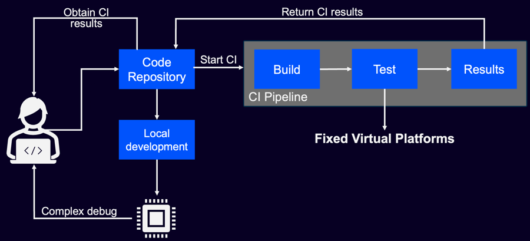
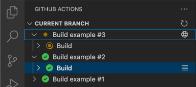

# Hands-On Lab: Using GitHub and Source Control Extensions in Visual Studio Code for CI/CD

This hands-on session will guide participants through the practical use of Visual Studio Code (VS Code) extensions to
enhance source control workflows using GitHub. Participants will:

- Use the built-in **Source Control** features of VS Code.
- Collaborate using the **GitHub Pull Requests and Issues** extension.
- Automate workflows using the **GitHub Actions** extension.

## Prerequisites

Ensure you have the following set up before starting:

- Fork [Hello_NUCLEO-F756ZG](https://github.com/Arm-Examples/Hello_NUCLEO-F756ZG) GitHub repository.
- Go to "Actions" tab and enable workflows.
- Go to "Settings" and enable **Issues**.
- VS Code installed with the following extensions:
    - [GitHub Pull Requests](https://marketplace.visualstudio.com/items?itemName=GitHub.vscode-pull-request-github)
    - [GitHub Actions](https://marketplace.visualstudio.com/items?itemName=GitHub.vscode-github-actions)
    - [Arm CMSIS Debugger](https://marketplace.visualstudio.com/items?itemName=Arm.vscode-cmsis-debugger)
    - [Arm Keil Studio Pack](https://marketplace.visualstudio.com/items?itemName=Arm.keil-studio-pack)
- STMicroelectronics NUCLEO-F756ZG board (optional for HIL).

## Lab 1: Working with Git and Source Control in VS Code

### Step 1: Clone the Repository

1. Open VS Code.
2. Press `Ctrl+Shift+P` (or `Cmd+Shift+P` on macOS) and type `Git: Clone`.
3. Enter the URL of your forked GitHub repository.
4. Choose a local directory and open the folder when prompted.

### Step 2: Explore the Source Control Tab

1. Click on the Source Control icon  in the Activity Bar (or press
   `Ctrl+Shift+G`).
2. Make changes to a file in the repository.
3. Observe how VS Code detects changes and lists them as "Changes".
4. Add a commit message in the input box at the top.
5. Click the checkmark icon to commit.
6. Accept the change to be staged and committed.

### Step 3: Push and Pull

1. The ellipsis (...) menu offers Git actions like push, pull, and sync.
2. Use the **Sync Changes** button to push to your repo.
3. If working in a team, pull changes made by others.

## Lab 2: Collaborating with GitHub Pull Requests

### Step 1: Open the GitHub Pull Requests Extension

1. Click on the GitHub icon  in the Activity Bar (added by the extension).
2. Sign in to GitHub when prompted.

### Step 2: Create a New Branch

1. Press `Ctrl+Shift+P` (or `Cmd+Shift+P` on macOS), then `Git: Create Branch`.
2. Name the branch, e.g., `feature/update-readme`.
3. Make a change in your project, save, stage, and commit.
4. You will be asked to create a pull request.
5. Fill in the title and description.
6. Submit the pull request to your repository’s default branch.

### Step 4: Review and Merge

1. View existing pull requests using the GitHub Pull Requests icon .
2. Select one to review.
3. Use built-in comments, reviews, and the merge button if you have permissions.
4. It is good practice to delete the branch after it has been merged.

## Lab 3: Monitoring Workflows with GitHub Actions

### Step 1: Open the GitHub Actions Extension

1. Click the GitHub Actions icon  in the Activity Bar.
2. If your repository already includes workflows, you’ll see them listed.
3. If not, navigate to `.github/workflows/` and add a workflow YAML file.

### Step 2: Trigger a Workflow

1. Push a change that triggers a workflow (e.g., on `push` or `pull_request`).
2. Observe the status of the workflow in the GitHub Actions tab:
   

### Step 3: View Workflow Logs

1. Click on a workflow run to see job steps and logs.
2. Use this to debug or monitor CI/CD behavior from within VS Code.

## Optional Exercises

- Set up a custom [GitHub Actions](https://docs.github.com/en/actions/writing-workflows/quickstart)
  workflow (e.g., for linting or building).
- Explore [GitHub Codespaces](https://github.com/features/codespaces) (if enabled on your account).
- Enable
  [branch protection](https://docs.github.com/en/repositories/configuring-branches-and-merges-in-your-repository/managing-protected-branches/about-protected-branches)
  and observe its effect on pull request workflows.

## Summary

By the end of this lab, you should be able to:

- Use VS Code's source control for everyday Git tasks.
- Collaborate efficiently using pull requests and inline reviews.
- Monitor and debug GitHub Actions workflows directly from your editor.
