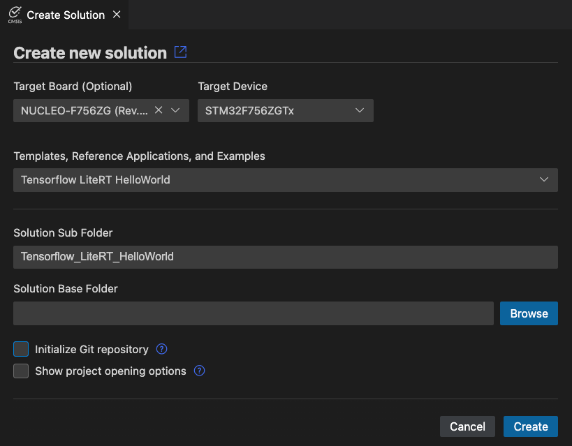
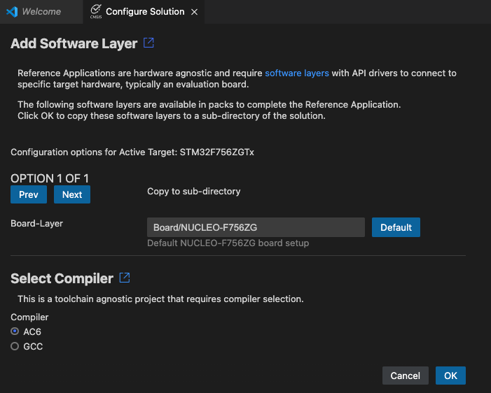
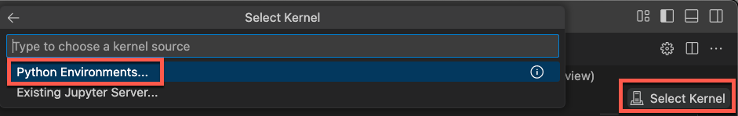
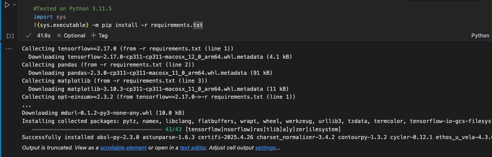
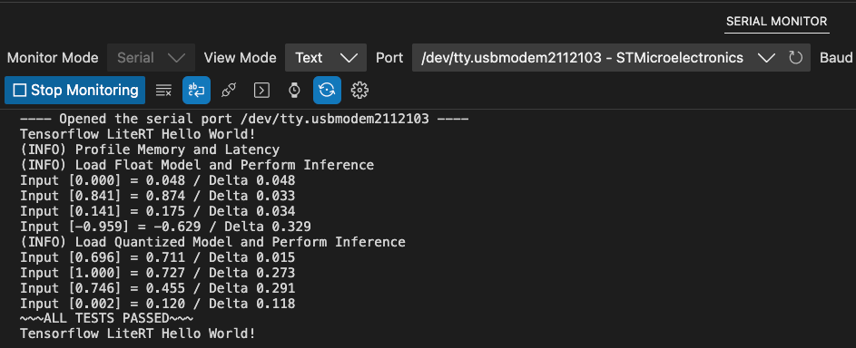

# TensorFlow Lite RT Hello World Example

This reference application demonstrates how to use
[TensorFlow Lite for Microcontrollers](https://www.tensorflow.org/lite/microcontrollers) with CMSIS support. The
example trains and runs a small neural network that mimics a sine wave function.

## Prerequisites

- VS Code installation with the following extensions:
    - [Arm Keil Studio Pack](https://marketplace.visualstudio.com/items?itemName=Arm.keil-studio-pack) (make sure that
      the [Arm CMSIS Solution](https://marketplace.visualstudio.com/items?itemName=Arm.cmsis-csolution) extension has
      the pre-release version 1.53.0).
    - [Arm CMSIS Debugger Pack](https://marketplace.visualstudio.com/items?itemName=Arm.vscode-cmsis-debugger)
    - [GitHub Pull Requests](https://marketplace.visualstudio.com/items?itemName=GitHub.vscode-pull-request-github)
    - [GitHub Actions](https://marketplace.visualstudio.com/items?itemName=GitHub.vscode-github-actions)
- [Python 3.11.9](https://www.python.org/downloads/release/python-3119/) installed
- Compatible development board providing STDIO interface

## Create the project

The project is available as a
[reference application](https://open-cmsis-pack.github.io/cmsis-toolbox/ReferenceApplications/) that can be targeted
towards several boards.

1. Open a new empty instance of VS Code.
2. Go to **CMSIS View** and select “Create a New Solution”:  
   
3. In the "Create Solution" dialog, configure as follows:
   - Target Board: NUCLEO-F756ZG  
   - Reference Application: Tensorflow LiteRT HelloWorld  
   - Choose a suitable base directory.  
   
4. Click “Create”.
5. In the following "Configure Solution" dialog just press OK.  
   
6. Open `vcpkg_configuration.json` and add the Arm GNU Toolchain using the GUI preview. Save the file.  
   

## Configure Project

In the `TFLiteRT_HelloWorld.csolution.yml`, insert the following block in `- target-types\- type` section:
  
```yml
     target-set:
       - set: 
         debugger:
           name: ST-LINK
         images:
           - project-context: TFLiteRT_HelloWorld.Debug
```

## Train the Model

1. In the **Explorer view**, navigate to `Training/train_hello_world_model.ipynb` and click to open the file.
2. In the top-right corner of this Jupyter notebook, click **Select Kernel** and then on **Python Environments...** to
   select a Python kernel for the next steps (tested with 3.11.5 and 3.11.12):  
   
3. Scroll down the file and press play () next to all Python code snippets:  
   

Run all cells to:

- Train the neural network
- Generate the model
- Copy model files to the Model layer

Each cell contains information about the purpose of the cell and what can be configured. The notebook allows you to
experiment with:

- Different model architectures
- Training parameters
- Data preprocessing

## Build and Run

In the **CMSIS view**:

1. Click "Build" to compile the project
2. Click "Run" to flash and execute
3. Monitor the output via the board's STDIO interface, which will display the deviation from an expected value.

### Exemplary output



## Project Structure

```txt
├── Source/
│   └── hello_world_test.cpp            # Main application code
├── Training/
│   └── train_hello_world_model.ipynb   # Model training
├── Model/
│   └── model.clayer.yml                # Model layer configuration
└── TFLiteRT_HelloWorld.cproject.yml    # Project configuration
```

## Troubleshooting

1. If build fails, verify:
   - Board layer is properly selected.
   - Memory settings are configured.
   - All required CMSIS-Packs are installed.

2. If execution fails, check:
   - Serial connection to board.
   - Memory allocation errors.
   - Stack/heap configuration.
