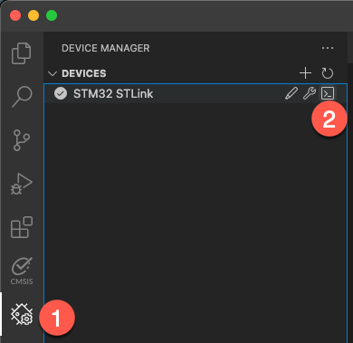

# Mongoose Wizard Project

This project is generated by [Mongoose Wizard](https://mongoose.ws/wizard/), a visual web dashboard builder for
embedded devices. It was used at the Arm Developer meet up at embedded world 2024.

An in-depth [tutorial](https://mongoose.ws/documentation/#tutorials) as well as the
[Mongoose User Guide](https://mongoose.ws/documentation/) are available for further details.

## Project Conversion

The objective is to successfully convert, build, and debug a non-trivial project on modern hardware.

### Steps

The following steps only show the required minimum to get the project converted. The instructor will show much more
around Keil Studio.

#### Project conversion

1. Open the folder with the uvprojx file in VS Code.
2. Right-click the `wizard.uvprojx` file and select "Convert µVision project to CMSIS solution".
3. Change `wizard.csolution.yml` and `wizard.cproject.yml` files according to
   [documentation](https://github.com/Open-CMSIS-Pack/vscode-cmsis-debugger/blob/main/docs/setup.md):
   In the csolution, add before the `- projects` node:

   ```yml
   misc:
    - for-compiler: AC6
      C-CPP:
        - -gdwarf-5
      ASM:
        - -gdwarf-5
      Link:
        - --entry=Reset_Handler
   ```

   In the cproject, add at the end:

   ```yml
   output:
    type:
    - elf
    - hex
    ```

4. Build the project. It should build with one warning:

   ```txt
   Warning: A1950W: The legacy armasm assembler is deprecated. Consider using the armclang integrated assembler instead.
   ```

#### Debug configuration

1. Using the GUI view, add the Arm GNU Toolchain to the `vcpkg_configuration.json` file as you need it for debugging.
   Save the file.
2. Go to **CMSIS View – Manage Solution Settings** - **Run and Debug** and create a new debug configuration
   (“+ Add New”).
3. Create a new debug configuration for “CMSIS Debugger: pyOCD”. A `launch.json` file will be create in `.vscode`.
4. In the **Explorer View**, go to `out/wizard/Target_1` and right-click `wizard.hex`. Select
   “Copy relative path”.
5. Add that path to the `load` command around line 15 in the `.vscode/launch.json` file:

   ```json
                   "load out/wizard/Target_1/wizard.hex",
   ```

6. Before debugging the project, you need to patch the cbuild-run.yml file. For all RAMs in the `system-resources:` node, add:  
   `        access: rwx`  
   And for all ROMs, add:  
   `        access: rx`

> [!NOTE]
> This step will be eliminated in the next version of the CMSIS-Toolbox.

### Open a serial Terminal

1. Go to **Device Manager** view.
2. Open a serial console to the STLink.  
   
3. In the pop up box, enter a baud rate of 115200.

### Start a debug session

1. Go to **Debug View**, select the "CMSIS Debugger: pyOCD".
2. Press "Play".  
   

### Using the project

You can use the web server by entering the IP address that is shown in the serial console in your web browser.

## Result

This session demonstrates how easy it is to convert a non-trivial µVision project to CMSIS solution format and how to
set it up for debugging.
