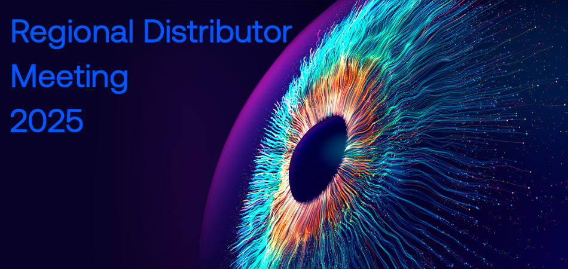

# FAE Track

This repository contains the workshop material for the FAE track on the second day of the RDM.

## Prerequisites

- VS Code installation with the following extensions:
    - [Arm Keil Studio Pack](https://marketplace.visualstudio.com/items?itemName=Arm.keil-studio-pack)
    - [Arm CMSIS Debugger Pack](https://marketplace.visualstudio.com/items?itemName=Arm.vscode-cmsis-debugger)
- [GitHub](https://www.github.com) account
- [Python 3.11.9](https://www.python.org/downloads/release/python-3119/) installed

All attendees will receive a [NUCLEO-F756ZG](https://www.st.com/en/evaluation-tools/nucleo-f756zg.html) development
board to follow some of the sessions.

## Agenda

| Time  | Topic                                       |
|-------|---------------------------------------------|
| 9.00  | [Project conversion](./Mongoose/README.md)  |
| 9.20  | [Reference application](./RefApp/README.md) |
| 10.00 | [CI/CD with GitHub](./CI_CD/README.md)      |
| 10.30 | Break                                       |
| 10.45 | [ML applications](./MLApp/README.md)        |
| 12.00 | Lunch                                       |
