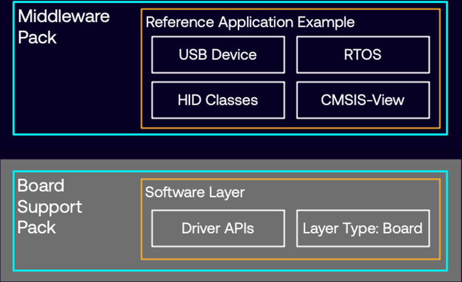
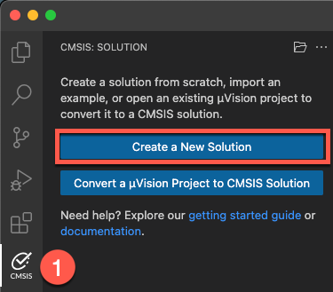
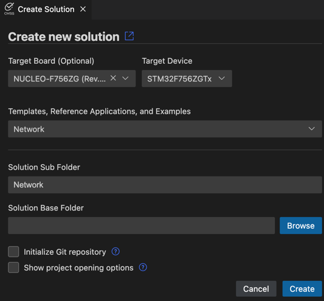
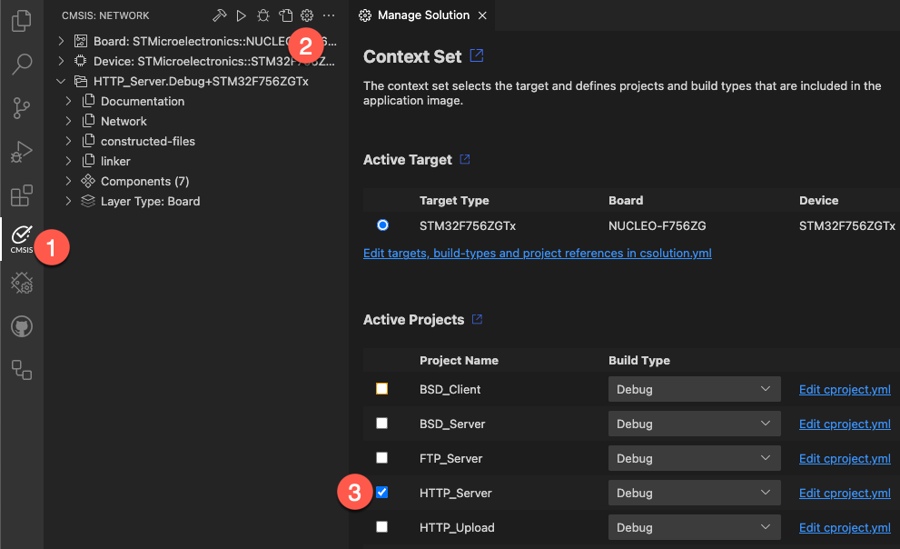

# Reference Applications

CMSIS v6 has the concept of
[software layers](https://open-cmsis-pack.github.io/cmsis-toolbox/build-overview/#software-layers). With these layers,
it is easy to create [reference applications](https://open-cmsis-pack.github.io/cmsis-toolbox/ReferenceApplications/)
that scale to many different targets (devices/boards) that offer the required layers.

## Objective

The NUCLEO-F756ZG development board supports layers and can thus used to create reference applications. In this
workshop, a simple HTTP web server application using [MDK-Middleware](https://github.com/ARM-software/MDK-Middleware)
is created using this approach.

## Steps

### Create the project

1. Open a new empty instance of VS Code.
2. Go to **CMSIS View** and select “Create a New Solution”:  
   
3. In the "Create Solution" dialog, use these settings:  
   - Target Board: NUCLEO-F756ZG
   - Reference Appliaction: Network
   - Browse for a suitable base folder on your machine.  
   
4. Click “Create”.
5. In the following "Configure Solution" dialog just press OK.  
   

### Configure Project

1. Go to **CMSIS View**.
2. Press the cog wheel to open the "Manage Solution" dialog.
3. In the dialog, set the "HTTP_Server" as active project.  
     
4. Change the `Network.csolution.yml` and `HTTP_Server/HTTP_Server.cproject.yml` files according to
   [documentation](https://github.com/Open-CMSIS-Pack/vscode-cmsis-debugger/blob/main/docs/setup.md):  
   In the csolution, add before the `- projects` node:

   ```json
   misc:
    - for-compiler: AC6
      C-CPP:
        - -gdwarf-5
      ASM:
        - -gdwarf-5
      Link:
        - --entry=Reset_Handler
   ```

   In the cproject, add at the end:

   ```json
   output:
    type:
    - elf
    - hex
    ```

5. In the `HTTP_Server/RTE/Network/Net_Config_ETH_0.h` file, set the Ethernet MAC address to the one printed on your
   development board box.
6. Build the project. It should build without errors or warnings.

### Debug configuration

1. Using the GUI view, add the Arm GNU Toolchain to the `vcpkg_configuration.json` file as you need it for debugging.
   Save the file.
2. Go to **CMSIS View – Manage Solution Settings** - **Run and Debug** and create a new debug configuration
   (“+ Add New”).
3. Create a new debug configuration for “CMSIS Debugger: pyOCD”. A `launch.json` file will be create in `.vscode`.
4. In the **Explorer View**, go to `out/HTTP_Server/STM32F756ZGTx/Debug` and right-click `HTTP_Server.hex`. Select
   “Copy relative path”.
5. Add that path to the `load` command around line 15 in the `.vscode/launch.json` file:

   ```json
                   "load out/HTTP_Server/STM32F756ZGTx/Debug/HTTP_Server.hex",
   ```

### Open a serial Terminal

1. Go to **Device Manager** view.
2. Open a serial console to the STLink.  
   
3. In the pop up box, enter a baud rate of 115200.

### Start a debug session

1. Go to **Debug View**, select the "CMSIS Debugger: pyOCD".
2. Press "Play".  
   

### Using the project

You can use the web server by entering the IP address that is shown in the serial console in your web browser.

Alternatively, to find the IP address, open the file `HTTP_Server.c` and:

- Find line 42: `    printf("IP4: %s\n",ip_ascii);` and set a breakpoint there.
- Add `ip_ascii` to the Watch.
- Run until the breakpoint and observe the IP address in the Watch window!

## Result

This session demonstrates how easy it is to set up a reference example project for a development board that is
supported by CMSIS-Packs with CMSIS-Drivers and layers. OOBE is great and the project is up and running within
minutes.
