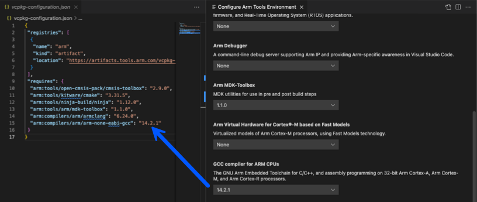
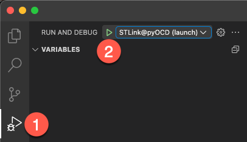

# Converting µVision Projects to CMSIS Solution Format

This hands-on lab demonstrates how to convert a µVision project (`.uvprojx`) to the CMSIS solution format using modern
development tools. The project, originally generated with the [Mongoose Wizard](https://mongoose.ws/wizard/), serves
as a realistic example used during the Arm Developer Meetup at Embedded World 2024.

An in-depth [tutorial](https://mongoose.ws/documentation/#tutorials) as well as the
[Mongoose User Guide](https://mongoose.ws/documentation/) are available for further details.

Objective: Convert, build, and debug a non-trivial embedded application on a modern development platform.

## Procedure Overview

The following steps provide the minimum required procedure to convert, build, and debug the project. Your instructor
may demonstrate additional features of Keil Studio.

### Step 1: Convert the Project

1. Launch VS Code and open the ./uv2csolution/Mongoose folder containing the `wizard.uvprojx` file.
2. Select the **Explorer** view.
3. Right-click the `wizard.uvprojx` file and choose **Convert µVision project to CMSIS solution**.
4. Open `vcpkg_configuration.json` and add the Arm GNU Toolchain using the GUI preview by entering
       "arm:compilers/arm/arm-none-eabi-gcc": "14.2.1"  
   
5. Save the file (**CTRL+S**).
6. Edit the generated `wizard.csolution.yml` and `wizard.cproject.yml` as follows:

   - In `wizard.csolution.yml`, insert the following block in `- target-types\- type` section:
  
     ```yml
           target-set:
             - set: 
               debugger:
                 name: ST-LINK
     ```

   - In `wizard.csolution.yml`, insert the following block before the `- projects` section:
  
     ```yml
       misc:
         - for-compiler: AC6
           C-CPP:
             - -gdwarf-5
           ASM:
             - -gdwarf-5
           Link:
             - --entry=Reset_Handler
     ```
     Save the file.

   - In `wizard.cproject.yml`, append the following section:

     ```yml
       output:
         type:
         - elf
         - hex
         - map
     ```
     Save the file.
     
7. Build the project (**CMSIS-View** -> Hammer symbol). You should encounter a single expected warning:

   ```txt
   Warning: A1950W: The legacy armasm assembler is deprecated. Consider using the armclang integrated assembler instead.
   ```

### Step 2: Open a Serial Terminal

1. Go to the **Device Manager** view.
2. Open a serial console connected to the ST-Link interface.  
   
3. In the pop-up dialog, set the baud rate to **115200**.

### Step 3: Start the Debug Session

1. Switch to the **Run and Debug View** and select **STLink@pyOCD (launch)**.
2. Click the **Play** icon to launch the debug session.  
   

### Step 4: Interact with the Web Server

Once the application is running, open a web browser and enter the IP address shown in the serial console ...


...to access the device-hosted web server:


## Conclusion

This lab demonstrates how to convert a complex µVision project to the CMSIS solution format, integrate debugging support,
and interact with the deployed application.

## Where to go next

The next lab demonstrates how to create a
[reference application](https://open-cmsis-pack.github.io/cmsis-toolbox/ReferenceApplications/) for a development board
supporting [software layers](https://open-cmsis-pack.github.io/cmsis-toolbox/build-overview/#software-layers).
Please continue with the [README](../RefApp/README.md).
